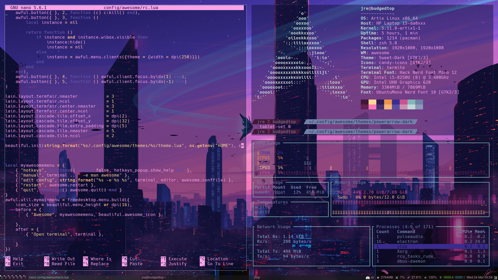

<h1 align="center">my dotfiles</h1>
<h2 align="center">a small pile of configs and scripts i use </h2>  

note: this is far from finished

  

**the scripts:**

can, unsuprisingly, be found in `scripts/`

- `an-bg.sh` tries to open the arg you give it and set it as your background. to stop it you can either kill mpv or run the script again with no arg. original script by **[CalinLeafshade](https://github.com/CalinLeafshade)** can be found **[here](https://github.com/CalinLeafshade/dots/blob/master/bin/bin/bg.sh)**. **requires** `xwinwrap`, `mpv`

- `coltheme.sh` is a very setup-specific script; it replaces the color palette of `termite`, the wallpaper and the `awesome` config i currently run. 
palettes can be customized and placed in `config/termite/` with the name theme*name_here*.txt and an accompanying wallpaper called wall*name_here*.png (this might change in the future tho). 

- `tablet-conf.sh` is a simple little script i run to configure my huion kamvas 13 but any other drawing tablet *should* also work with it. to configure what the buttons of your tablet do go to where the `xsetwacom set $id_tab Button` lines start. args are -1 (info) to 4, letting you set the orientation. **requires** the wacom drivers

- `uni-vpn-ex.sh` is a example script that works for me (and hopefully you too) that lets you connect to a vpn without the use of a *real* networkmanager. be very careful tho since you can easily expose your psk that way. **requires** `openconnect`

- `yt.sh` is a clone of **[this](https://github.com/sayan01/scripts/blob/master/yt)** by **[sayan01](https://github.com/sayan01)**. **requires** `mpv`, `youtube-dl fzf`, `rofi/dmenu`, `gnu-grep` 

**the aliases**

found in the `bash_aliases` file

they are nothing special but make life easier and all of scripts listed above have their own :)

**the configs**

can be found in `config/` and are mostly pretty basic (for now)

**the setup**

i use [artix linux](https://artixlinux.org/) with [awesome](https://awesomewm.org/) as my wm and a theme based on **[lcpz](https://github.com/lcpz/)** **[awesome-copycats](https://github.com/lcpz/awesome-copycats)**, more specific **[powerarrow-dark](https://github.com/lcpz/awesome-copycats/tree/master/themes/powerarrow-dark)**.

**misc**

right now it's rather empty, and rhe folders are self explanatory

- `plymouth/` includes a boot theme called `nerv10` which is based on **[this](https://aur.archlinux.org/packages/plymouth-theme-arch10/)** made by  **[Mauro A. Meloni](https://maurom.com/)** (i basically just slapped a downscaled logo on there).

#

<h3 align="center">TODO:</h3>  

- [x] include boot theme
- [ ] login interface - customize xdm
- [ ] logoff interface
- [ ] conky theme
- [ ] adjust theme (rc lua & powerarrow-dark)
- [ ] new way to store load themes?
- [ ] tweak colours of the themes further
- [ ] window decoration
- [ ] start working on the eva theme
