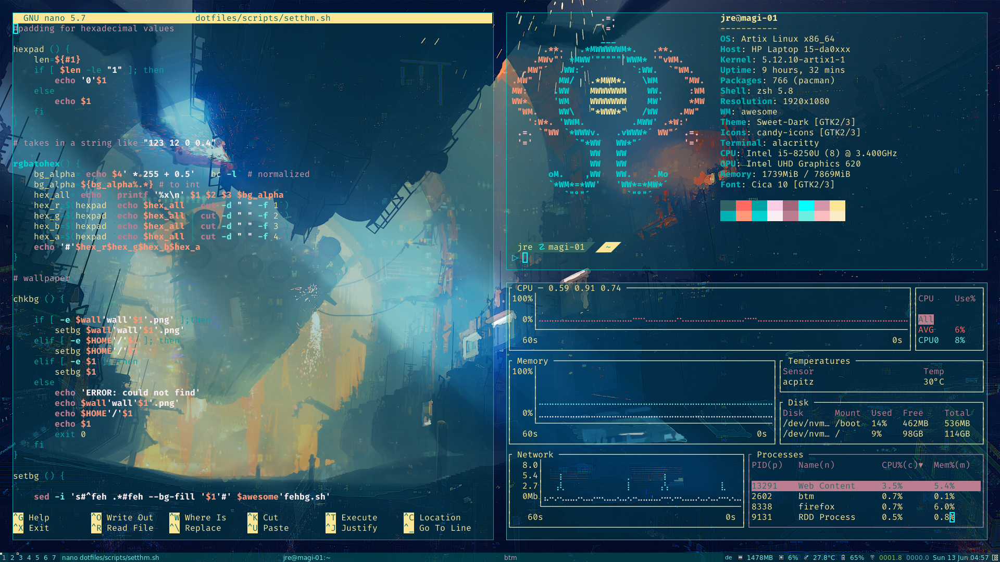

<h1 align="center">my dotfiles</h1>
<h2 align="center">a small pile of configs and scripts i use </h2>  

note: this is far from finished

  

**the scripts:**

can, unsuprisingly, be found in `scripts/`

- `an-bg.sh` tries to open the arg you give it and set it as your background. to stop it you can either kill mpv or run the script again with no arg. original script by **[CalinLeafshade](https://github.com/CalinLeafshade)** can be found **[here](https://github.com/CalinLeafshade/dots/blob/master/bin/bin/bg.sh)**. **requires** `xwinwrap`, `mpv`

- `setthm.sh` is a very setup-specific script, so be warned! It takes zero, two or three arguments. with 0 args it will ask you what you want to change. there are three options available: [t]heme, [p]alette and [w]allpaper.
themes are stored in `config/awesome/themes/` and can be listed by typing 0. to select a theme either write its name or use its index. needs awesome to be restarted.
palettes are stored in `config/themes/palettes/` and change the colour-scheme of the terminal, in my case alacritty (commented out is the version for termite) and the colours used by the awesome theme in use. because of that it restarts awesome after a palette-swap.
to change the wallpaper just give a path to an image or use the number of one of the wallpapers in the `config/themes/wallpapers/` to set it.
when using args it looks like this: [t/p/w] [int/string] for two args and [tval] [pval] [wval] for three.

- `tablet-conf.sh` is a simple little script i run to configure my huion kamvas 13 but any other drawing tablet *should* also work with it. to configure what the buttons of your tablet do go to where the `xsetwacom set $id_tab Button` lines start. args are -1 (info) to 4, letting you set the orientation. **requires** the wacom drivers

- `uni-vpn-ex.sh` is a example script that works for me (and hopefully you too) that lets you connect to a vpn without the use of a *real* networkmanager. be very careful tho since you can easily expose your psk that way. **requires** `openconnect`

- `webstorage.sh` an experimental script that connects you to a CalDAV filesystem using wdfs. currently it is a bit broken. when using option [u] it unmounts the filesystem and kills openconnect because of option [v] connects to a vpn before attempting to connect to the filesystem. *like with `uni-vpn-ex.sh` make sure to read- and write protect the file.* **requires** `wdfs`

- `yt.sh` is a clone of **[this](https://github.com/sayan01/scripts/blob/master/yt)** by **[sayan01](https://github.com/sayan01)**. **requires** `mpv`, `youtube-dl fzf`, `rofi/dmenu`, `gnu-grep` 

**the aliases**

found in the [bash_aliases](https://github.com/jreeee/dotfiles/blob/master/bash_aliases) file

they are nothing special but make life easier and all of scripts listed above have their own :)

**the configs**

can be found in `config/` and are mostly pretty basic (for now)

- `zsh` is my main shell. the theme i use, [bubblified](https://github.com/jreeee/dotfiles/blob/master/config/zsh/themes/bubblified.zsh-theme), is based on **[this](https://github.com/hohmannr/bubblified)** by **[hohmannr](https://github.com/hohmannr)**. I changed the code a bit to make it more compact and realize the the design i had in mind.

**the setup**

i use **[artix linux](https://artixlinux.org/)** with **[awesome](https://awesomewm.org/)** as my wm and a theme based on **[lcpz](https://github.com/lcpz/)** **[awesome-copycats](https://github.com/lcpz/awesome-copycats)**, more specific **[powerarrow-dark](https://github.com/lcpz/awesome-copycats/tree/master/themes/powerarrow-dark)**.

**misc**

right now it's rather empty, and the folders are self explanatory

- `plymouth/` includes a boot theme called `nerv10` which is based on **[this](https://aur.archlinux.org/packages/plymouth-theme-arch10/)** made by  **[Mauro A. Meloni](https://maurom.com/)** (i basically just slapped a downscaled logo on there).

#

<h3 align="center">TODO:</h3>  

- [ ] login interface ?
- [ ] logoff interface ?
- [ ] conky theme
- [ ] adjust theme (rc lua & powerarrow-dark)
- [ ] tweak colours of the themes further
- [ ] window decoration ?
- [ ] start working on the eva theme
