<h1 align="center">my dotfiles</h1>
<h2 align="center">a couple of configs and scripts and other things i use </h2>  

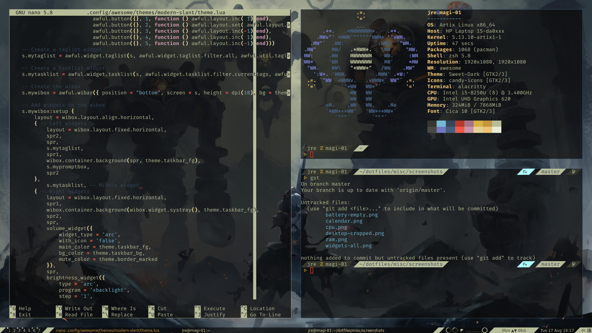
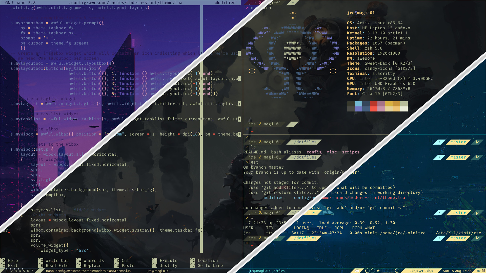
<h4 align="center">left is modern-slant whith palette 1, right is a mashup with palette 2 (left), 1 (center) and 3 (right)</h4>

<h2 align="center"> the theme: </h2>

the theme shown in the screenshots above is my theme `modern-slant` which originally was a modified version of **[powerarrow-dark](https://github.com/lcpz/awesome-copycats/tree/master/themes/powerarrow-dark)**. The widgets it uses are more or less heavily modified versions of the **[awesome-wm-widgets](https://github.com/streetturtle/awesome-wm-widgets)**. more info on the zsh theme can be found below in `my configs - zsh`.

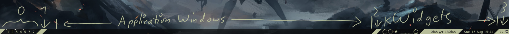

- **0:** workspaces
- **1:** run-prompt 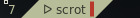
- **2:** (empty) taskbar, with programs open: 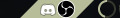
- **3:** keyboard layout, awesomewm window layout

<h2 align="center">widgets:</h2>

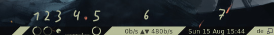

- **1: volume** - scroll up/down to raise/lower the volume, left click toggles mute (also changes its color), right click toggles pavucontrol

- **2: brightness** - scroll up/down to raise/lower the brightness, lmb sets it to 20%, rmb toggles 0%/current brightness 

- **3: ram** - shows ram usage like in `1)`

- **4: cpu** - shows the cpu usage `2)`. note that awesome's usage normally isn't *that* high, it's mainly because of the popup 

- **5: battery** - shows current battery status, when charging it has an extra dot, when critical the color changes and you get notified every now and again.

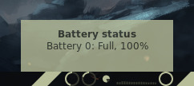 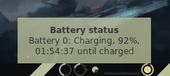 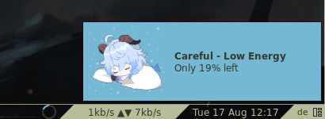

- **6: network** - shows current up- and download speeds

- **7: calendar** - is linked to the clock `3)` and just shows the date. scroll up/down to see other months

`1)` 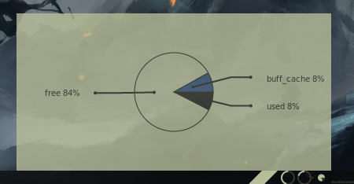 `2)` 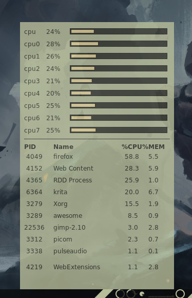 `3)` 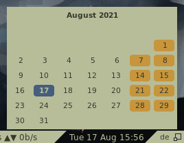

<h2 align="center"> the scripts: </h2>

can, unsuprisingly, be found in `scripts/`

- `an-bg.sh` tries to set the arg you give it as your background. to stop it you can either kill mpv or run the script again with no arg. because it uses mpv the arg can also be a link to a youtube video, which is pretty cool. original script by **[CalinLeafshade](https://github.com/CalinLeafshade)** can be found **[here](https://github.com/CalinLeafshade/dots/blob/master/bin/bin/bg.sh)**. **requires** `xwinwrap`, `mpv`

- `setthm.sh` is a very setup-specific script, so be warned! It takes zero, two or three arguments. with 0 args it will ask you what you want to change. there are three options available: [t]heme, [p]alette and [w]allpaper.
**themes** are stored in `config/awesome/themes/` and can be listed by typing 0. to select a theme either write its name or use its index. has to restart awesome to apply.
**palettes** are stored in `config/themes/palettes/` and change the colour-scheme of the terminal, in my case alacritty (commented out is the version for termite) and the colours used by the awesome theme in use as well as the taskbar. because of that it restarts awesome after a palette-swap.
to change the **wallpaper** just give a path to an image or use the number of one of the wallpapers in the `config/themes/wallpapers/` to set it.
when using args it looks like this: [t/p/w] [int/string] for two args and [tval] [pval] [wval] for three.

- `tablet-conf.sh` is a simple little script i run to configure my huion kamvas 13 but any other drawing tablet *should* also work with it. to configure what the buttons of your tablet do go to where the `xsetwacom set $id_tab Button` lines start. args are -1 (info) to 4, letting you set the side on which the tablet relative to the main display is. **requires** the wacom drivers

- `uni-vpn-ex.sh` is a example script that works for me (and hopefully you too) that lets you connect to a vpn without the use of a *real* networkmanager. **be very careful** since you can easily expose your psk that way. **requires** `openconnect`

[//]: <> (- `webstorage.sh` an experimental script that connects you to a CalDAV filesystem using wdfs. currently it is a bit broken. when using option [u] it unmounts the filesystem and kills openconnect because of option [v] connects to a vpn before attempting to connect to the filesystem. *like with `uni-vpn-ex.sh` make sure to read- and write protect the file.* **requires** `wdfs`)

- `yt.sh` is a clone of **[this](https://github.com/sayan01/scripts/blob/master/yt)** by **[sayan01](https://github.com/sayan01)**. **requires** `mpv`, `youtube-dl fzf`, `rofi/dmenu`, `gnu-grep` 

<h3 align="center"> the aliases: </h3>

found in the [bash_aliases](https://github.com/jreeee/dotfiles/blob/master/bash_aliases) file

they are nothing special but make life easier and all of scripts listed above have their own :)

<h2 align="center"> the configs: </h2>

can be found in `config/` 

- most of them don't change too much, like `mpv`, `nano`, and `neofetch` but add a bit qol for me.

- `alacritty` / `termite` is modified quite a bit and also gets changed when setting a different palette.

- `awesome` - holds my (messy) rc.lua. `fehbg.sh` is a small script that sets a new wallpaper and changes the wallpaper that awesome uses to the new one. the nice thing about this is that you don't have to restart awesome for a new wallpaper.

- `picom` a sample config i found *somewhere* and tweaked a bit

- `zsh` is my main shell. the theme i use, [bubblified](https://github.com/jreeee/dotfiles/blob/master/config/zsh/themes/bubblified.zsh-theme), is based on **[this](https://github.com/hohmannr/bubblified)** by **[hohmannr](https://github.com/hohmannr)**. I changed the code a bit to make it more compact and realize the the design i had in mind.

- `themes` hold the **palettes** `setthm.sh` uses as well as some **wallpapers** i like

- `x11` the xorg configs for the system i'm using

<h2 align="center"> the system: </h2>

i use a relatively cheap HP laptop with a i5, 8gb of ram and a 15.4in screen running **[artix linux](https://artixlinux.org/)** with **[awesome](https://awesomewm.org/)**, **[picom](https://github.com/yshui/picom)** and **[zsh](https://www.zsh.org/)**. because the screen has trash color accuracy it is likely that the palettes only look good on this pc and really bad on any *decent* display, sorry for that.

<h2 align="center"> misc: </h2>

right now it's rather empty, and the folders are self explanatory

- `plymouth/` includes a boot theme called `nerv10` which is based on **[this](https://aur.archlinux.org/packages/plymouth-theme-arch10/)** made by  **[Mauro A. Meloni](https://maurom.com/)** (i basically just slapped a downscaled logo on there).

- lain-solid / lain-solid-col: ascii-art i made of the copland os logo shown in the anime serial experiments lain. gets used by `neofetch` to display the os. the col-version contains color-tags which makes it looks nicer imho.

#

<h3 align="center">TODO:</h3>  

- [ ] login interface ?
- [ ] logoff interface ?
- [ ] tweak colours of the themes
- [ ] start working on the eva theme
- [ ] conky theme ?
- [ ] refactor rc.lua
- [ ] refactor the widget-code 
- [ ] deploy script?
